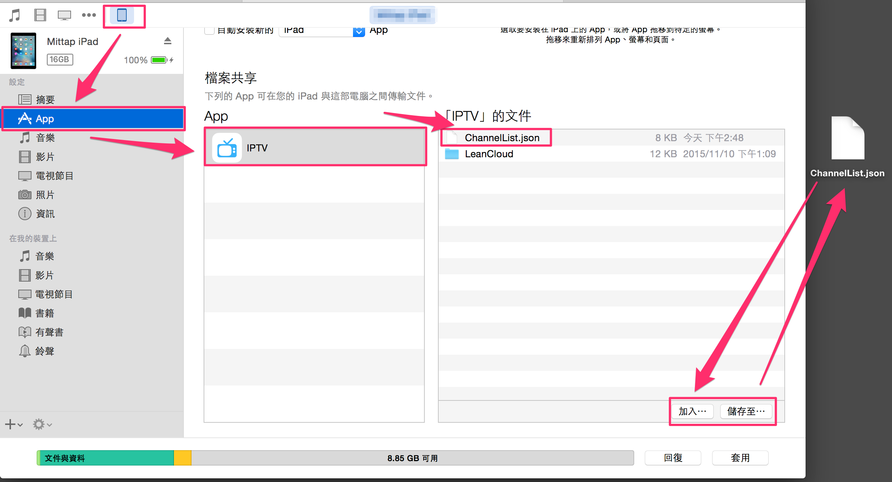

# IPTV
簡單提供網路電視 (基本上都是台灣地區電視) 在 iPhone or iPad 上觀看.  
懶得使用後台, [頻道列表][2] 放在 client 端.

## 需求
實機 only, 不支援模擬器, 因為 IJKMediaFramework.framework 我只有編譯實機下的 framework.

## ijkplayer
為什麼使用 [ijkplayer][1] 而不是使用原生的 Library?

因為 [頻道列表][2] 裡的 HLS m3u8 檔案並不正確, 如果使用 AVPlayerViewController, 大約播放  10 秒之後就會自動停止了.

另外列表裡有些網址使用 rtmp, 所以就直接使用 ijkplayer 當作播放器了.

## 安裝
如果你是 iOS 開發者, 應該不用再贅述.  
如果你不是 iOS 開發者, 你必須有以下條件:

-  一個 Apple Id.
-  [Xcode][3] 7.0 之後的版本

之後 [下載][4] IPTV, 再照著 [教學][5] 便可以把 IPTV 安裝至你的 device.

## 修改列表
你可以透過 iTunes 導出 / 導入電視列表, 如圖所示:

## ISSUE
頻道無法播放, 或是你有其他直播源請至 ISSUE 發佈.

## LICENSE
[MIT LICENSE][6]

[1]: https://github.com/Bilibili/ijkplayer "ijkplayer"
[2]: IPTV/ChannelList.json "頻道列表"
[3]: https://developer.apple.com/xcode/download/ "xcode"
[4]: https://github.com/shinrenpan/IPTV/archive/master.zip "下載"
[5]: http://www.dycksir.com/2015/10/10/Launching-Your-App-on-Devices-Xcode-7-without-certificate/ "教學"
[6]: LICENSE "LICENSE"