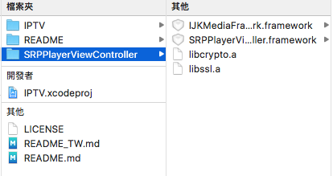
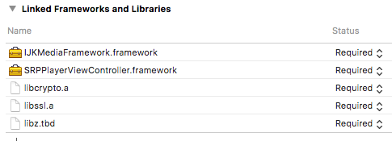

iOS universal 影片播放器. 我用它來觀看 IPTV.

## 需求 ##
- [SRPPlayerViewController][2]
- [ijkplayer][3]

## 編譯 ##
依照 [SRPPlayerViewController][2] 步驟編譯需要的 framework.

你需要 **SRPPlayerViewController.framework, IJKMediaFramework.framework, libcrypto.a, libssl.a**, 拖拉到 SRPPlayerViewController folder.

別忘記加入 `libz.tbd`.

## TV 頻道
這個 App 不提供任何 IPTV 資訊, 你必須手動輸入.

按下新增按鈕新增一個 IPTV 資訊, 或是使用 iTunes File Sharing 編輯內容.

IPTV 資訊儲存在 [ChannelList.plist][1].

[1]: IPTV/ChannelList.plist "ChannelList.plist"
[2]: https://github.com/shinrenpan/SRPPlayerViewController "SRPPlayerViewController"
[3]: https://github.com/Bilibili/ijkplayer "ijkplayer"
